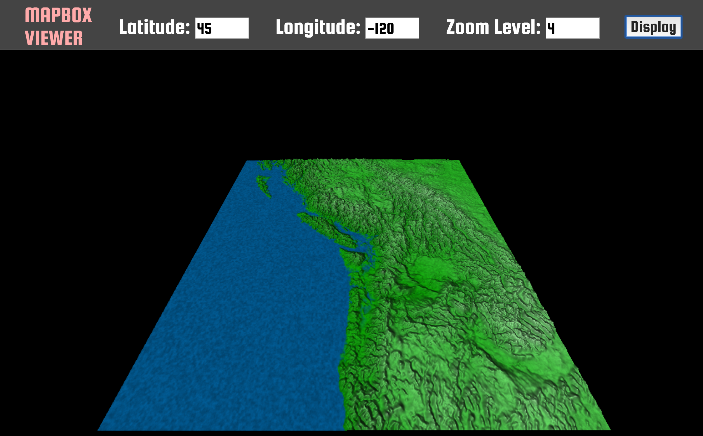

# Mapbox three.js viewer

This is a quick and simple viewer for [Mapbox](https://www.mapbox.com/) implemented with three.js.

## Instructions

1. Create a new directory and clone this repo by running: `git clone https://github.com/bzztbomb/mapbox_viewer` at a command prompt.
2. Run a local webserver in the base directory of the repo.  If you have python, run this: `python -m SimpleHTTPServer`.
3. Go to `http://localhost:8000?MAPBOX_API_KEY` in a web browser, replacing `MAPBOX_API_KEY` with you Mapbox API key.

